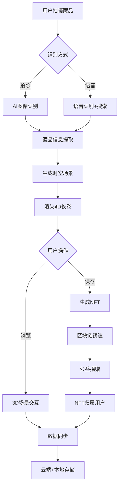

# MillenniumTrace｜Built with Comate & Wenxin-4.5 —— 用AI让藏品说话，30秒穿越千年

## 🎯 业务目标

**千年影迹·MillenniumTrace** 是一个创新的**文博AI互动产品**，核心目标是：
- 让博物馆藏品"活起来"，实现文物的4D时空情景重现
- 降低文化传播门槛，用户30秒内即可体验藏品的千年历史
- 通过NFT技术永久保存文化记忆，并联动公益事业

## 📸 核心功能

1. **智能识别** 📸
   - 拍照或语音触发藏品识别
   - 30秒内生成4D时空长卷

2. **裸眼3D体验** 🎭
   - 无需额外设备的沉浸式时空穿越
   - Three.js驱动的3D场景渲染

3. **0成本NFT生成** 🎨
   - 一键生成影迹NFT（基于文昌链）
   - 永久保存文化记忆

4. **跨端协同** 🌐
   - Web端（React）+ APP端（Flutter）无缝切换
   - 覆盖所有使用场景

5. **公益联动** 💚
   - 每个NFT自动捐赠，支持文化保护

## 开源协议
MIT License - 核心模块全开源，欢迎社区贡献

## 🚀 快速开始

### 环境要求
- Node.js (v14.0.0 或更高版本)
- npm (v6.0.0 或更高版本) 或 yarn
- Flutter (v3.1.0 或更高版本) - 仅APP端开发需要

### 本地测试

1. **克隆项目**
```bash
git clone https://github.com/your-org/millennium-trace.git
cd millennium-trace
```

2. **Web端快速启动**
```bash
cd web
npm install
npm run dev
```
Web端将在 http://localhost:3000 启动，默认使用模拟数据，所有核心功能都可以测试。

3. **APP端启动**
```bash
cd app
flutter pub get
flutter run
```

### 功能测试指南

**Web端测试**（推荐先从Web端开始）：
- ✅ **主页浏览**：欣赏动态背景和交互动画
- ✅ **相机识别**：点击"开始时空之旅"测试AI识别功能（使用模拟数据）
- ✅ **NFT画廊**：点击"浏览影迹画廊"查看模拟NFT数据
- ✅ **设备适配**：在不同设备和浏览器中测试响应式设计

**注意**：开发环境自动启用模拟数据，无需真实的AI服务或区块链连接。

## 📱 开发指南

### Web端开发
```bash
cd web
npm install
npm run dev          # 开发模式
npm run build        # 构建生产版本
npm run preview      # 预览构建结果
npm run test         # 运行测试
```

### APP端开发
```bash
cd app
flutter pub get
flutter run          # 运行调试版本
flutter build apk    # 构建Android APK
flutter build ios    # 构建iOS版本（需要Mac环境）
```

### 环境配置

**Web端环境变量**（web/.env.development）：
- `VITE_USE_MOCK=true` - 启用模拟数据
- `VITE_ENABLE_DEBUG=true` - 启用调试模式
- 其他配置详见 `web/.env.development`

**生产部署**：
- Web端：`npm run build` 后部署 `dist` 目录
- APP端：使用Flutter构建工具生成安装包

### 构建部署
```bash
# Web端构建
cd web && npm run build

# APP端构建
cd app && flutter build apk

# 完整构建脚本（如果存在）
./scripts/build.sh all
```

## 📊 数据实体

### 1. **User (用户)**
```typescript
{
  id: string;
  name: string;
  avatar?: string;
  createdAt: Date;
  nftCount: number;
  preferences: UserPreferences;
}
```

### 2. **Artifact (藏品)**
```typescript
{
  id: string;
  name: string;
  description: string;
  images: string[];
  category: string;
  period: string;
  museum: string;
  recognizedAt: Date;
}
```

### 3. **Scene (场景)**
```typescript
{
  id: string;
  artifactId: string;
  type: '制作' | '流通' | '入馆' | '修复' | '数字归还';
  timeline: number;
  modelUrl: string;
  narration: string;
  generatedAt: Date;
}
```

### 4. **NFT**
```typescript
{
  id: string;
  artifactId: string;
  tokenId: string;
  contractAddress: string;
  owner: string;
  metadata: NFTMetadata;
  mintedAt: Date;
}
```

## 🔄 业务流程

### 主流程：从拍照到NFT生成



### 关键子流程

#### 1. **AI识别流程**
- 用户拍照 → 图像上传 → 文心4.5多模态识别 → 返回藏品信息

#### 2. **场景生成流程**
- 藏品信息 → AI生成场景脚本 → 3D建模渲染 → 生成时空长卷

#### 3. **NFT铸造流程**
- 用户确认 → 元数据准备 → 文昌链铸造 → 自动捐赠 → 归属确认

#### 4. **跨端同步流程**
- 操作触发 → IndexedDB本地存储 → OSS云端同步 → 其他端拉取更新

## 💡 技术亮点

1. **AI驱动**：文心4.5多模态模型实现智能识别和场景生成
2. **跨端协同**：Web（React）+ APP（Flutter）共享TypeScript类型定义
3. **区块链集成**：文昌链NFT实现文化资产永久保存
4. **性能优化**：Three.js + WebGL实现流畅3D体验
5. **离线优先**：IndexedDB本地存储，支持离线浏览

## 📁 项目结构
```
millennium-trace/
├── web/                    # Web端应用
│   ├── src/
│   │   ├── components/     # 通用组件
│   │   ├── pages/         # 页面组件
│   │   ├── services/      # 业务服务层
│   │   └── hooks/         # 自定义Hooks
│   └── package.json
│
├── app/                    # Flutter移动端
│   ├── lib/
│   │   ├── core/          # 核心配置
│   │   │   ├── config/    # 路由、主题配置
│   │   │   └── di/        # 依赖注入
│   │   ├── domain/        # 领域层
│   │   │   └── entities/  # 数据实体
│   │   └── presentation/  # 表现层
│   │       ├── bloc/      # 状态管理
│   │       └── pages/     # 页面
│   └── pubspec.yaml
│
└── shared/                 # 跨端共享
    └── types/             # TypeScript类型定义
```

## 📄 开源协议

MIT License - 核心模块全开源，欢迎社区贡献

## 🤝 贡献指南

欢迎提交Issue和Pull Request，让我们一起让文物"活起来"！

## 📞 联系我们

- 项目主页: https://millennium-trace.dev
- 技术支持: support@millennium-trace.dev

---

**这是一个将AI、3D渲染、区块链和文博教育深度融合的创新产品，通过技术手段让文物"穿越千年"与现代用户对话！** 🎉
```
Initial commit: feat: photo-to-4D-scene（web+app跨端基础版）